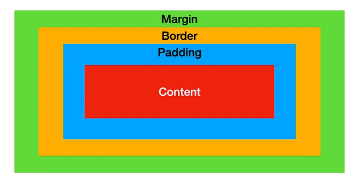

# CSS

## Adding CSS :
Adding CSS in HTML file for style the HTML code.
### Inline CSS :
It is added directly within HTML tag using the **style** attribute.
```html
<p style="color: blue; font-size: 16px;">This is an inline CSS example.</p>
```
### Internal CSS :

```html
<head>
    <style>
        p {
            color: green;
            font-size: 18px;
        }
    </style>
</head>
<body>
    <p>This is an internal CSS example.</p>
</body>
```


### External CSS :

```html
<head>
    <link rel="stylesheet" href="styles.css">
</head>
<body>
    <p>This is an external CSS example.</p>
</body>
```


### !important Keyword :
The !important keyword is used to give higher priority to a specific CSS rule, overriding other declarations.
```css
p {
  color: blue !important;   
  /* Color will add blue for !important */
}

p {
  color: red;
}
```

### CSS Comment :

```css
/* This is a CSS comment */
p {
  color: purple; /* This color applies to paragraph text */
}
```

---

## CSS Selector :
Targeting HTML contant.
### Element Selector :
Targets all instances of a specific HTML element.
```css
p {
  color: blue;
}
```


### ID Selector :
Targets a specific element with a unique id attribute. The # symbol is used before the id name.
```css
#header {
  background-color: lightgrey;
}
```


### Class Selector :
Targets elements with a specific class attribute. The . symbol is used before the class name.
```css
.highlight {
  background-color: yellow;
}
```


### Group Selector :
Applies the same style to multiple selectors. Selectors are separated by commas.
```css
h1, h2, p {
  margin: 0;
  padding: 10px;
}
```


### Universla Selector :
Targets all elements on the page. The * symbol is used as the universal selector.
```css
* {
  margin: 0;
  padding: 0;
}
```

### Attribute Selector :

#### Basic Attribute Selector :
```html
<input type="text" placeholder="Enter name">
<input type="password" placeholder="Enter password">
<input type="email" placeholder="Enter email">
```

```css
[input] {
  border: 1px solid gray; /* Applies to all input elements */
}
```

#### 2. Attribute Equals Value

```html
<input type="text" placeholder="Enter name">
<input type="password" placeholder="Enter password">
```

```css
[type="password"] {
  background-color: lightyellow; /* Highlights password inputs */
}
```

#### 3. Attribute Contains Word

```html
<button class="btn primary">Submit</button>
<button class="btn secondary">Cancel</button>
```
```css
[class~="btn"] {
  padding: 10px; /* Styles elements with 'btn' in the class attribute */
}
```


#### 4. Attribute Starts With

```html
<a href="https://example.com">Secure Link</a>
<a href="http://example.com">Non-Secure Link</a>
```
```css
[href^="https"] {
  color: green; /* Applies only to secure links (https) */
}
```


#### 5. Attribute Ends With

```html
<a href="document.pdf">Download PDF</a>
<a href="image.jpg">View Image</a>
```
```css
[href$=".pdf"] {
  text-decoration: underline; /* Styles links ending with '.pdf' */
}
```


#### 6. Attribute Contains Substring

```html


```
```css
[src*="profile"] {
  border-radius: 50%; /* Makes profile images circular */
}
```


#### 7. Combine Attribute Selectors
```html
<input type="checkbox" checked>
<input type="checkbox">
```
```css
[input[type="checkbox"][checked]] {
  outline: 2px solid blue; /* Highlights checked checkboxes */
}
```


---

## Font :
### Font Style :
Specifies the style of the font, such as normal, italic, or oblique.

```css
p {
  font-style: italic;
}
```


### Font Size :
Defines the size of the font. It can be set in various units like pixels (px), em, rem, percentages (%), etc.
```css
p {
  font-size: 16px;
}
```


### Font  :
Controls the thickness (or boldness) of the font. Common values are normal, bold, bolder, lighter, or numeric values (100 to 900).
```css
p {
  font-weight: bold;
}
```


### Font Family :
Specifies the typeface or a list of typefaces for the text. You can provide multiple font names as a fallback list.
```css
p {
  font-family: "Arial", "Helvetica", sans-serif;
}
```


### Font Varient :
Controls the use of small-caps or other font variations.
```css
p {
  font-variant: small-caps;
}
```


### External/Google Font :
```html
<head>
  <link href="https://fonts.googleapis.com/css2?family=Roboto:wght@400;700&display=swap" rel="stylesheet">
</head>
```

```css
body {
  font-family: 'Roboto', sans-serif;
}
```
---
## Colors :
### Hexadecimal :
```css
p {
  color: #FF5733;
}
```

### RGB : 

```css
p {
  color: rgb(255, 87, 51);
}
```

### RGBA :
Similar to RGB but with an additional alpha (opacity) value, ranging from 0 (completely transparent) to 1 (completely opaque).
```css
p {
  color: rgba(255, 87, 51, 0.5);
}
```


### HSL (Hue, Saturation, Lightness)
* **Hue:** A degree on the color wheel (0-360), where 0 is red, 120 is green, and 240 is blue.
* **Saturation:** A percentage value (0% is a shade of gray, 100% is the full color).
* **Lightness:** A percentage value (0% is black, 50% is normal, 100% is white).

```css
p {
  color: hsl(11, 100%, 60%);
}
```


### Background Color :

```css
div {
  background-color: rgb(255, 87, 51); /* RGB */
}
```

### Background Image

#### 1. Set Background Image :
```css
element {
  background-image: url("image-path");
}
```

#### 2. Multiple Background :
```css
element {
  background-image: url("image1.jpg"), url("image2.png");
}
```

#### 3. Position :
```css
background-position: center; /* top, bottom, left, right, x y */
```

#### 4. Size :
```css
background-size: cover; /* cover, contain, or width height */
```

#### 5. Repeat :
```css
background-repeat: no-repeat; /* repeat, repeat-x, repeat-y */
```

#### 6. Attachment :
```css
background-attachment: fixed; /* scroll, local */
```

#### 7. Shorthand :
```css
background: url("image.jpg") no-repeat center/cover;
```

#### 8. Gradients With Image : 
```css
background-image: linear-gradient(rgba(0,0,0,0.5), rgba(0,0,0,0.5)), url("image.jpg");
```

### Text Color :

```css
p {
  color: #FF5733; /* HEX */
}
```
---

## Border :
### Border Style :
Defines the style of the border. Common values include **none**, **solid**, **dashed**, **dotted**, **double, groove**, **ridge**, **inset**, and **outset**.
```css
div {
  border-style: solid;
}
```

### Border Width :
Can be specified in **pixels (px)**, **ems (em)**, or other length units. Also supports keywords like **thin**, **medium**, and **thick**.
```css
div {
  border-width: 2px;
}
```

### Border Color :
```css
div {
  border-color: #FF5733; /* HEX */
}
```

### Border :
A shorthand property that sets the **border-width**, **border-style**, and **border-color** in one declaration.

```css
div {
  border: 2px solid red;
}
```

### Border Redious :
Rounds the corners of the border. Can be set for all corners, or individually for each corner.
```css
div {
  border-radius: 10px 20px 30px 40px;
                /* top , right , bottom , left */
}
```

### Heigth :
Defines the height of an element. Can be set using various units such as **pixels (px)**, **percentages (%)**, **ems (em)** or **viewport units (vh).**
```css
div {
  height: 200px;
}
```


### Width :
Same as heigth.
```css
div {
  width: 50vw;
}
```

### Max/Min - Height/Width :
```css
div {
  max-width: 500px;  /* Restricts width to 500px max */
  min-width: 200px;  /* Ensures width is at least 200px */
  max-height: 300px; /* Restricts height to 300px max */
  min-height: 100px; /* Ensures height is at least 100px */
}
```

---
## Box :
### Box Mode :


### Padding :
* **Definition** :Space between the content of an element and its border. It is inside the element’s border.
* **Properties**: Can be set for all sides or individually for each side (top, right, bottom, left).

* **Shorthand**: padding: [top] [right] [bottom] [left];
```css
div {
  padding: 10px 15px 20px 25px;
}
```
* [top-botton] [right-left]
```css
div {
  padding: 10px 15px;
}
```
* [top-bottom-right-left]
```css
div {
  padding: 20px;
}
```
* Individual Side :
```css
div {
  padding-top: 10px;
  padding-right: 15px;
  padding-bottom: 20px;
  padding-left: 25px;
}
```


### Margin :
* **Definition**: Space outside the border of an element. It creates distance between the element’s border and surrounding elements.

* **Properties**: Can be set for all sides or individually for each side (top, right, bottom, left).

* **Shorthand**: margin: [top] [right] [bottom] [left];
```css
div {
  margin: 10px 15px 20px 25px;
}
```
* [top-botton] [right-left]
```css
div {
  margin: 10px 15px;
}
```
* [top-bottom-right-left]
```css
div {
  margin: 20px;
}
```
* Individual Side :
```css
div {
  margin-top: 10px;
  margin-right: 15px;
  margin-bottom: 20px;
  margin-left: 25px;
}
```

---
## Display Property :
### Display Block (display: block)
**Definition**: Makes an element a block-level element.
**Behavior**:
* Takes up the full width available, causing a line break before and after the element.
* Can have width, height, margins, and padding adjusted.

Examples of Block Elements: **div, h1, p, header.**


### Display Inline (display: inline)
**Definition**: Makes an element an inline element.
**Behavior**:
* Takes up only as much width as necessary, without forcing a line break.
* Cannot have width or height set directly.

Examples of Inline Elements: **span, a , strong , em**


### Block vs. Inline
* **Block Elements:**

    * Take up the full width of their container.
    * Start on a new line.
    * Support width, height, margin, and padding properties.

* **Inline Elements:**

    * Take up only as much width as their content needs.
    * Do not start on a new line.
    * Support only horizontal padding, margin, and line height.


### Display Convertion :
* **Converting Block to Inline**
```css
div {
  display: inline;
  /* This rule changes a block-level element like <div> to behave as an inline element. */
}
```

* **Convertion Inline to Block**

```css
span {
  display: block;
  /* This rule changes an inline element like <span> to behave as a block element. */
}
```


###  Inline-Block (display: inline-block)
* **Definition**: Combines the characteristics of both inline and block elements.
* **Behavior**:
    * Elements are laid out inline, without line breaks, but can have width, height, padding, and margin.
    * Use Case: Useful for creating horizontally aligned blocks that need sizing.

```css
div {
  display: inline-block;
  width: 150px;
  height: 150px;
  background-color: lightcoral;
  margin: 10px;
}
```


### Box Sizing Border Box (box-sizing: border-box)
* **Definition**: Alters the box model so that width and height include padding and borders, not just the content.
* **Default Behavior**: The default value is content-box, where width and height only include the content, and padding and borders are added outside.

```css
div {
  box-sizing: border-box;
  width: 300px;
  padding: 20px;
  border: 10px solid black;
  /* The div will remain 300 pixels wide, with padding and border inside this width. */
}
```
---
## Position Property :
### Position: Relative (position: relative)
The element is positioned relative to its normal position. You can move it using top, right, bottom, or left without affecting other elements.


```css
.relative-box {
  position: relative;
  top: 20px;
  left: 30px;
}
```
### position: absolute;
The element is positioned relative to its nearest positioned ancestor (not static). If no such ancestor exists, it is positioned relative to the initial containing block (usually the viewport).


```css
.absolute-box {
  position: absolute;
  top: 50px;
  right: 20px;
}
```
### position: fixed;
The element is positioned relative to the viewport, meaning it stays in the same place even when the page is scrolled.

```css
.fixed-box {
  position: fixed;
  bottom: 10px;
  left: 10px;
}
```
### position: sticky;
The element toggles between relative and fixed positioning, depending on the scroll position. It "sticks" to a defined position as you scroll past it.


```css
.sticky-box {
  position: sticky;
  top: 0;
  background-color: yellow;
}
```

----
## Units :
### px (Pixels)
A fixed unit representing the number of pixels on the screen. It provides precise control but is not responsive to different screen sizes.


```css
.box {
  width: 200px;
  height: 100px;
}
```
### % (Percentage)
A relative unit based on the parent element's size. It is useful for creating responsive designs.
```css
.box {
  width: 50%;
  height: 30%;
}
```
### em
A relative unit based on the font size of the element's parent. 1em equals the current font size. It scales with the element's font size.

```css
.text {
  font-size: 2em; /* If the parent font size is 16px, this will be 32px */
}
```
### rem
A relative unit based on the root element's (usually <html>) font size. It provides consistent scaling across the entire document.

```css
.text {
  font-size: 1.5rem; /* If the root font size is 16px, this will be 24px */
}
```
### vh (Viewport Height)
A relative unit based on the height of the viewport. 1vh equals 1% of the viewport's height.

```css
.box {
  width: 50vw; /* 50% of the viewport's width */
}
```
### vw (Viewport Width)
A relative unit based on the width of the viewport. 1vw equals 1% of the viewport's width.


```css
.box {
  height: 50vh; /* 50% of the viewport's height */
}
```

### float
The float property is used to position an element to the left or right of its container, allowing text or inline elements to wrap around it.

**Common values:**
* **left**: Floats the element to the left.
* **right**: Floats the element to the right.
* **none**: Default value, no float applied.
```css
.float-box {
  float: left;
  width: 200px;
  height: 100px;
  margin: 10px;
}
```
### clear
The clear property is used to control the behavior of elements that follow floated elements, ensuring that they do not wrap around the floated elements.

**Common values:**
* **left**: No element allowed on the left side.
* **right**: No element allowed on the right side.
* **both**: No element allowed on either side.
* **none**: Default value, allows wrapping.

```css
.clear-box {
  clear: both;
}
```
### overflow
The overflow property controls what happens to content that is too large for its container.

**Common values:**
* **visible**: Content is not clipped and may overflow the container.
* **hidden**: Content is clipped, and the rest is hidden.
* **scroll**: Content is clipped, but scrollbars are added to see the rest of the content.
* **auto**: Similar to scroll, but scrollbars are added only if needed.
```css
.overflow-box {
  width: 200px;
  height: 100px;
  overflow: scroll;
}
```

---
## FlexBox
Flexbox is a layout model that allows you to design complex layouts with ease by distributing space along a container's main and cross axes.


### display: flex;
Defines a flex container and enables the flex context for its children (flex items).

```css
.flex-container {
  display: flex;
}
```
### flex-direction
Specifies the direction of the flex items in the flex container.

**Common values:**
* **row**: Default, items are placed horizontally from left to right.
* **row-reverse**: Items are placed horizontally from right to left.
* **column**: Items are placed vertically from top to bottom.
* **column-reverse**: Items are placed vertically from bottom to top.


```css
.flex-container {
  flex-direction: row;
}
```
### flex-wrap
Specifies whether the flex items should wrap or not within the container.

**Common values**:
* **nowrap**: Default, items will not wrap.
* **wrap**: Items will wrap onto multiple lines.
* **wrap-reverse**: Items will wrap onto multiple lines in reverse order.
```css
.flex-container {
  flex-wrap: wrap;
}
```
### flex-flow
A shorthand property for flex-direction and flex-wrap.
```css
.flex-container {
  flex-flow: row wrap;
}
```
### justify-content
Aligns flex items along the main axis (horizontally by default).

**Common values:**
* **flex-start**: Default, items align to the start of the container.
* **flex-end**: Items align to the end of the container.
* **center**: Items are centered along the main axis.
* **space-between**: Items are evenly distributed with the first item at the start and the last item at the end.
* **space-around**: Items are evenly distributed with equal space around them.
* **space-evenly**: Items are evenly distributed with equal space between them.
```css
.flex-container {
  justify-content: center;
}
```
### align-items
Aligns flex items along the cross axis (vertically by default).

**Common values:**
* **stretch**: Default, items stretch to fill the container.
* **flex-start**: Items align to the start of the cross axis.
* **flex-end**: Items align to the end of the cross axis.
* **center**: Items are centered along the cross axis.
* **baseline**: Items align along their baseline.
```css
.flex-container {
  align-items: center;
}
```
### align-content
Aligns flex lines (rows or columns) within the flex container when there is extra space on the cross axis.

**Common values:**
* **stretch**: Default, lines stretch to fill the container.
* **flex-start**: Lines align to the start of the container.
* **flex-end**: Lines align to the end of the container.
* **center**: Lines are centered along the cross axis.
* **space-between**: Lines are evenly distributed with the first line at the start and the last line at the end.
* **space-around**: Lines are evenly distributed with equal space around them.
* **space-evenly**: Lines are evenly distributed with equal space between them.
```css
.flex-container {
  align-content: space-between;
}
```
### order
Controls the order of individual flex items. The default order is 0.

```css
.flex-item {
  order: 2;
}
```
### flex-grow

Defines the ability of a flex item to grow relative to the rest of the flex items when space is available. The default value is 0.


```css
.flex-item {
  flex-grow: 1;
}
```
### flex-shrink
Defines the ability of a flex item to shrink relative to the rest of the flex items when space is limited. The default value is 1.
```css
.flex-item {
  flex-shrink: 2;
}
```
### flex-basis
Specifies the initial size of a flex item before any space distribution occurs. It can be specified in any CSS size unit (e.g., px, %, em). The default value is auto.

```css
.flex-item {
  flex-basis: 200px;
}
```
### align-self
Allows you to override the align-items property for individual flex items, aligning them individually along the cross axis.

**Common values:**
* **auto**: Default, follows the container's align-items property.
* **flex-start**, **flex-end**, **center**, **baseline**, **stretch**: Same as align-items values but for individual items.
```css
.flex-item {
  align-self: flex-end;
}
```
---

## Important Factors in Responsive Design 

1. **Viewport and Meta Tag**  
   Defines how the website is displayed on different screen sizes.  
   Example:  
   ```html
   <meta name="viewport" content="width=device-width, initial-scale=1.0">
   ```

2. **Flexible Grids**  
   Use percentage-based widths to ensure elements adapt to screen sizes.  
   Example:  
   ```css
   .container {
     width: 90%;
     max-width: 1200px;
     margin: 0 auto;
   }
   ```

3. **Fluid Images and Media**  
   Make images scale within their containers without overflowing.  
   Example:  
   ```css
   img {
     max-width: 100%;
     height: auto;
   }
   ```

4. **Media Queries**  
   Adjust styles based on device characteristics like screen width.  
   Example:  
   ```css
   @media (max-width: 768px) {
     body {
       font-size: 14px;
     }
   }
   ```

5. **Breakpoints**  
   Define specific screen widths where the layout should change.  
   Example Breakpoints:  
   - `max-width: 480px` for phones.  
   - `max-width: 768px` for tablets.

6. **Typography with Relative Units**  
   Use scalable font sizes like `em` or `rem`.  
   Example:  
   ```css
   body {
     font-size: 1rem; /* Equals 16px */
   }
   ```

7. **Flexbox and Grid Layout**  
   Enable flexible and adaptive layouts with modern CSS techniques.  
   Example (Flexbox):  
   ```css
   .flex-container {
     display: flex;
     flex-wrap: wrap;
   }
   ```

8. **Touch-Friendly Design**  
   Ensure interactive elements are easy to tap with proper spacing.  
   Example:  
   ```css
   button {
     padding: 12px 20px;
   }
   ```

9. **Orientation and Aspect Ratio**  
   Use media queries to optimize for portrait and landscape views.  
   Example:  
   ```css
   @media (orientation: portrait) {
     .image {
       width: 100%;
     }
   }
   ```

10. **Performance Optimization**  
    Optimize images and enable lazy loading for smaller devices.  
    Example:  
    ```html
    
    ```  

---
## Media Queries
Media queries are a feature in CSS that allow you to apply styles conditionally based on certain criteria, such as the screen size, device orientation, resolution, and more. They are essential for creating responsive web designs that adapt to different devices.


```css
/* Basic syntex */
@media media-type and (media-feature: value) {
  /* CSS rules go here */
}
```
* media-type: Defines the type of device (e.g., screen, print, all).
* media-feature: Defines conditions like screen width, height, orientation, etc.


### Responsive Design (Screen Width)


```css
/* For devices with a maximum width of 600px (e.g., mobile phones) */
@media screen and (max-width: 600px) {
  .container {
    width: 100%;
    padding: 10px;
  }
}

/* For devices with a minimum width of 601px and maximum width of 1200px (e.g., tablets) */
@media screen and (min-width: 601px) and (max-width: 1200px) {
  .container {
    width: 80%;
    padding: 20px;
  }
}

/* For devices with a minimum width of 1201px (e.g., desktops) */
@media screen and (min-width: 1201px) {
  .container {
    width: 70%;
    padding: 30px;
  }
}
```
### Device Orientation
Apply styles based on whether the device is in portrait or landscape orientation.

```css
/* For devices in landscape mode */
@media screen and (orientation: landscape) {
  .gallery {
    display: flex;
    flex-direction: row;
  }
}

/* For devices in portrait mode */
@media screen and (orientation: portrait) {
  .gallery {
    display: flex;
    flex-direction: column;
  }
}
```
### Combining Multiple Conditions
```css
@media screen and (min-width: 768px) and (orientation: landscape) {
  .sidebar {
    display: block;
  }
}
```


---
## Box Shadow 
### Basic Shadow :
A simple shadow with no blur or spread.
```css
.box {
  box-shadow: 5px 5px;
}
```
### Blurred Shadow :
Adds a blur effect to the shadow.
```css
.box {
  box-shadow: 5px 5px 10px;
}
```
### Colorful Shadow
A shadow with a specific color.
```css
.box {
  box-shadow: 5px 5px 10px rgba(0, 0, 0, 0.5); /* Semi-transparent black shadow */
}
```
### Spread Shadow
Adjusts the spread of the shadow to make it larger or smaller.
```css
.box {
  box-shadow: 5px 5px 10px 2px rgba(0, 0, 0, 0.5); /* Slightly larger shadow */
}
```
### Inset Shadow
Creates an inner shadow (shadow inside the element).

```css
.box {
  box-shadow: inset 5px 5px 10px rgba(0, 0, 0, 0.5); /* Inner shadow */
}
```
### Multiple Shadows
You can add multiple shadows to an element by separating them with commas.

```css
.box {
  box-shadow: 5px 5px 10px rgba(0, 0, 0, 0.5),
              -5px -5px 10px rgba(255, 0, 0, 0.5); /* Two shadows: one black, one red */
}
```

---
## Text Shadow :
### Basic Text Shadow
A simple shadow with no blur.

```css
.text {
  text-shadow: 2px 2px;
}
```
### Blurred Text Shadow
Adds a blur effect to the shadow.
```css
.text {
  text-shadow: 2px 2px 5px;
}
```
### Colored Text Shadow
A shadow with a specific color.

```css
.text {
  text-shadow: 2px 2px 5px rgba(0, 0, 0, 0.5); /* Semi-transparent black shadow */
}
```
### Multiple Text Shadows
You can apply multiple shadows to text by separating them with commas.
```css
.text {
  text-shadow: 2px 2px 5px rgba(0, 0, 0, 0.5),
               -2px -2px 5px rgba(255, 0, 0, 0.5); /* Two shadows: one black, one red */
}
```
### Glowing Text Effect

Create a glow effect around the text using a large blur radius and a bright color.
```css
.text {
  text-shadow: 0 0 10px rgba(255, 255, 0, 0.8); /* Yellow glow effect */
}
```
### Inset Text Shadow
While text-shadow doesn't directly support inset shadows like box-shadow, you can simulate it by combining multiple shadows.


```css
.text {
  text-shadow: 1px 1px 2px #fff, /* Light shadow for highlight */
               -1px -1px 2px #000; /* Dark shadow for depth */
}
```

---
## Custom Properties(Variable)
### Declaring a Variable
Variables are defined using the -- prefix and can be declared globally or within a specific selector.
```css
:root {
  --primary-color: #3498db;
  --padding-size: 10px;
  /* In this example, --primary-color and --padding-size are custom properties that can be reused. */
}
```
### Using a Variable

To use a variable, reference it using the var() function.

```css
.button {
  background-color: var(--primary-color);
  padding: var(--padding-size);
}
```
### Local vs. Global Variables

* **Global Variables**: Defined in the :root selector, making them accessible throughout the entire stylesheet.
* **Local Variables**: Defined within a specific selector, making them available only within that selector.

```css
.card {
  --card-bg: #ffffff;
  background-color: var(--card-bg);
  padding: var(--padding-size); /* Uses global variable */
}
```
### Fallback Values

You can provide a fallback value in case the variable is not defined.

```css
.alert {
  color: var(--secondary-color, #e74c3c); /* Fallback to #e74c3c if --secondary-color is not defined */
}
```

---
## Animation
CSS animations are typically created using two main components:

1. **@keyframes Rule**: Defines the stages of the animation and the styles at each stage.
2. **Animation Properties**: Applied to an element to control the animation's timing, duration, and other characteristics.

### Define the @keyframes
The @keyframes rule specifies the CSS styles that will be applied at different stages of the animation. You can use percentages (0% to 100%) or keywords like from and to.
```css
@keyframes slide-in {
  0% {
    transform: translateX(-100%);
  }
  100% {
    transform: translateX(0);
  }
}
```
### Apply Animation Properties
Once you have defined the @keyframes, you apply the animation to an element using the animation properties.

```css
.box {
  animation-name: slide-in;
  animation-duration: 2s;
  animation-timing-function: ease-in-out;
  animation-delay: 0.5s;
  animation-iteration-count: infinite;
  animation-direction: alternate;
}
```
#### 1. animation-name
Specifies the name of the @keyframes to use for the animation.
```css
animation-name: slide-in;
```
#### 2. animation-duration
Defines how long the animation should take to complete one cycle.

```css
animation-duration: 2s; /* 2 seconds */
```

#### 3. animation-timing-function
Specifies the speed curve of the animation.

**Common values:**
* **linear**: The animation has the same speed from start to end.
* **ease**: Starts slow, then fast, then slow again (default).
* **ease-in**: Starts slow, then speeds up.
* **ease-out**: Starts fast, then slows down.
* **ease-in-out**: Starts slow, speeds up, then slows down.

```css
animation-timing-function: ease-in-out;
```

#### 4. animation-delay
Specifies a delay before the animation starts.
```css
animation-delay: 0.5s; /* 0.5 second delay */
```

#### 5. animation-iteration-count
Defines the number of times the animation should repeat.

**Common values:**
* **infinite**: The animation repeats indefinitely.
* **A number**: Specifies how many times the animation should play.

```css
animation-iteration-count: 3; /* Repeats 3 times */
```

#### 6. animation-direction

Defines the direction of the animation.

**Common values:**
* **normal**: The animation plays forward (default).
* **reverse**: The animation plays in reverse.
* **alternate**: The animation alternates between forward and reverse on each cycle.
* **alternate-reverse**: The animation alternates, starting in reverse.

```css
animation-direction: alternate;
```

#### 7. animation-fill-mode

Specifies how styles are applied before and after the animation plays.

**Common values:**
* **none**: The animation does not apply styles outside its duration (default).
* **forwards**: Retains the styles of the last keyframe after the animation ends.
* **backwards**: Applies the styles of the first keyframe before the animation starts.
* **both**: Applies both forwards and backwards styles.

```css
animation-fill-mode: forwards;
```

#### 8. animation-play-state
Allows you to pause and resume the animation.

**Common values:**
* **running**: The animation is running (default).
* **paused**: The animation is paused.
```css
animation-play-state: paused;
```

#### Animation Shorthand Property
animation: [animation-name] [animation-duration] [animation-timing-function] [animation-delay] [animation-iteration-count] [animation-direction] [animation-fill-mode] [animation-play-state];
```css
animation: bounce 2s ease-in-out 0.5s infinite alternate forwards;
```

### Pseudo-Classes
**CSS Pseudo-Classes**  
Pseudo-classes are keywords added to selectors to apply styles based on an element's state or position, without extra classes or JavaScript.

### :hover

Applies styles when the mouse pointer is over an element.
```css
a:hover {
  color: #ff5733; /* Change link color on hover */
}
```
### :focus
Applies styles when an element has focus (e.g., input fields).
```css
input:focus {
  border-color: #ff5733; /* Change border color of input when focused */
}
```

### :visited
Applies styles to links that have been visited by the user.
```css
a:visited {
  color: #6c757d; /* Change color of visited links */
}
```

### :link
Applies styles to links that have not yet been visited.

```css
a:link {
  color: #3498db; /* Color for unvisited links */
}
```

### :first-child
Applies styles to the first child element of its parent.
```css
p:first-child {
  font-weight: bold; /* Make the first paragraph bold */
}
```

### :last-child
Applies styles to the last child element of its parent.
```css
p:last-child {
  margin-bottom: 0; /* Remove bottom margin from the last paragraph */
}
```

### :nth-child(n)
Applies styles to the nth child element of its parent.
```css
li:nth-child(odd) {
  background-color: #f2f2f2; /* Alternate background color for odd list items */
}
```

### :checked
Applies styles to input elements that are checked (e.g., checkboxes, radio buttons).

```css
input:checked {
  background-color: #3498db; /* Change background color of checked inputs */
}
```

### :disabled
Applies styles to disabled form elements.

```css
input:disabled {
  background-color: #e0e0e0; /* Change background color of disabled inputs */
}
```
---
## Common Pseudo-Elements with Examples

#### 1. **`::before`**
Adds content before the element's main content.
```css
h1::before {
  content: "👉 ";
  color: red;
}
```

#### 2. **`::after`**
Adds content after the element's main content.
```css
h1::after {
  content: " 🎉";
  color: green;
}
```

#### 3. **`::first-letter`**
Styles the first letter of the element's text.
```css
p::first-letter {
  font-size: 2em;
  color: blue;
}
```

#### 4. **`::first-line`**
Styles the first line of the element's text.
```css
p::first-line {
  font-weight: bold;
  text-decoration: underline;
}
```

#### 5. **`::selection`**
Styles the portion of text selected by the user.
```css
::selection {
  background-color: yellow;
  color: black;
}
```

#### Key Notes

- **Usage**: Pseudo-elements are written using a double colon (`::`), although single colon (`:`) syntax is still supported in older versions of CSS for backward compatibility.
- **No Direct DOM Representation**: Pseudo-elements exist in the rendering layer but are not part of the DOM structure.
- **Combination with Pseudo-Classes**: They can be combined with pseudo-classes like `:hover` for interactive styling.
  
  Example:
  ```css
  a:hover::after {
    content: " (hovered)";
    color: orange;
  }
  ```

#### Practical Applications

- Adding decorative icons or symbols.
- Highlighting parts of text, like the first letter or line.
- Customizing text selection to match the theme.
- Implementing visual effects dynamically without extra HTML.

#### Example: Styling a Button with `::before` and `::after`
```html
<button class="fancy-button">Click Me</button>
```
```css
.fancy-button {
  position: relative;
  padding: 10px 20px;
  background-color: #3498db;
  color: white;
  border: none;
  font-size: 16px;
}

.fancy-button::before {
  content: "✨";
  position: absolute;
  left: -20px;
}

.fancy-button::after {
  content: "✨";
  position: absolute;
  right: -20px;
}
```


---
## Transition :
**CSS Transitions**  
CSS transitions allow gradual changes between styles over a set duration, creating smooth, animated effects that enhance user experience with fluid and interactive designs.

```
transition: [property] [duration] [timing-function] [delay];
```

```css
.box {
  width: 100px;
  height: 100px;
  background-color: #3498db;
  transition: background-color 0.5s ease, transform 0.5s ease;
}

.box:hover {
  background-color: #e74c3c;
  transform: scale(1.2);
}
```

### Transition Property :
#### transition-property
Specifies the CSS property to apply the transition to.

```css
transition-property: background-color;
```

#### transition-duration
Defines the duration of the transition.

```css
transition-duration: 0.5s;
```

#### transition-timing-function
Defines the timing function for the transition, affecting the speed curve.

**Common values:**
* **linear**: Constant speed.
* **ease**: Starts slow, speeds up, then slows down.
* **ease-in**: Starts slow, then speeds up.
* **ease-out**: Starts fast, then slows down.
* **ease-in-out**: Starts slow, speeds up, then slows down.
```css
transition-timing-function: ease-in-out;
```

#### transition-delay
Defines the delay before the transition starts.
```css
transition-delay: 0.5s;
```
---
## 2D Transform
CSS 2D transforms let you move, rotate, scale, and skew elements in a 2D space, altering their position, size, and orientation without affecting the layout of other elements.

### transform: translate(x, y)
**Effect**: Moves an element from its current position by x units horizontally and y units vertically.
```css
.box {
  transform: translate(50px, 100px);
}
```

### transform: rotate(angle)
**Effect**: Rotates the element 45 degrees clockwise.

```css
.box:hover {
  transform: rotate(45deg);
}
```

### transform: scale(x, y)
**Effect**: Scales the element to 1.5 times its original size.
```css
.box:hover {
  transform: scale(1.5);
}
 /* The scale function increases the element’s size proportionally based on the provided value. A value of 1 is the original size. */
```

### transform: skew(x-angle, y-angle)

**Effect**: Skews the element by 20 degrees horizontally and 10 degrees vertically.

```css
.box:hover {
  transform: skew(20deg, 10deg);
}
```
  
### transform: matrix(a, b, c, d, e, f)
**Effect**: Applies a combination of transformations including translation, skew, and scaling using a matrix.
```css
.box:hover {
  transform: matrix(1, 0.2, 0.2, 1, 50, 50);
}
```
---
## 3D Transforms :
### rotateX(angle)
Rotates an element around the X-axis.

```css
.rotate-x {
  transform: rotateX(45deg); /* Rotates the element 45 degrees around the X-axis */
}
```
### rotateY(angle)
Rotates an element around the Y-axis.

```css
.rotate-y {
  transform: rotateY(45deg); /* Rotates the element 45 degrees around the Y-axis */
}
```
### rotateZ(angle)
Rotates the element around the Z-axis (similar to 2D rotation).

```css
.rotate-z {
  transform: rotateZ(45deg); /* Rotates the element 45 degrees around the Z-axis */
}
```
### translateX(length)
Moves the element along the X-axis.

```css
.translate-x {
  transform: translateX(100px); /* Moves the element 100px to the right along the X-axis */
}
```
### translateY(length)
Moves the element along the Y-axis.

```css
.translate-y {
  transform: translateY(100px); /* Moves the element 100px down along the Y-axis */
}
```
### translateZ(length)
Moves the element along the Z-axis (toward or away from the viewer).

```css
.translate-z {
  transform: translateZ(100px); /* Moves the element 100px closer to the viewer along the Z-axis */
}
```
### scaleX(factor)
Scales the element along the X-axis.

```css
.scale-x {
  transform: scaleX(1.5); /* Scales the element 1.5 times its original width along the X-axis */
}
```
### scaleY(factor)
Scales the element along the Y-axis.

```css
.scale-y {
  transform: scaleY(1.5); /* Scales the element 1.5 times its original height along the Y-axis */
}
```
### scaleZ(factor)
Scales the element along the Z-axis.

```css
.scale-z {
  transform: scaleZ(1.5); /* Scales the element 1.5 times along the Z-axis, making it appear closer or further away */
}
```
### One-Shot 3D Transform Example
You can combine multiple 3D transforms in a single transform property.

```css
.transform-3d {
  transform: rotateX(45deg) rotateY(45deg) translateZ(50px) scale(1.2); 
  /* 
  Combines multiple 3D transforms:
  - Rotates the element 45 degrees around the X-axis
  - Rotates the element 45 degrees around the Y-axis
  - Moves the element 50px closer along the Z-axis
  - Scales the element 1.2 times in all directions
  */
}
```
---
## CSS GRID (Container Properties)

CSS Grid Layout is a powerful layout system that provides a way to arrange elements in rows and columns. The grid container is the parent element that holds grid items (children), and it controls the overall layout using various grid properties.

### display
* Defines the element as a grid container.
* Values: grid (or inline-grid for inline grids)
```css
.grid-container {
  display: grid;
}
```

### grid-template-columns
* Specifies the number and size of the columns in the grid.
* Values: Lengths (e.g., 100px), percentages (e.g., 50%), fr units, or keywords like auto.

```css
.grid-container {
  grid-template-columns: 1fr 2fr 1fr;
}
```

**Responsive Properties :**
1. **autofit**

* autofit adjusts the number of columns to fill the available space while ensuring that grid items take up as much space as possible.
* If there's extra space, it will stretch the items to fill the container.
```css
.grid-container {
  display: grid;
  grid-template-columns: repeat(auto-fit, minmax(150px, 300px));
  grid-gap: 10px;
}
```
2. **autofill**
* autofill behaves similarly to autofit, but instead of stretching the grid items, it keeps creating new columns (even if they are empty) to fill the space.
```css
.grid-container {
  display: grid;
  grid-template-columns: repeat(auto-fill, minmax(150px, 1fr));
  grid-gap: 10px;
  /* Explanation: This creates as many 150px-wide columns as possible, just like autofit. However, instead of stretching items to fit the container, it will create additional columns if there's extra space, ensuring that all grid items have a consistent width. */
}
```
3. **minmax**
* minmax is a function used to define a range for the size of grid tracks (rows or columns). It allows you to set a minimum size and a maximum size.
```css
.grid-container {
  display: grid;
  grid-template-columns: repeat(3, minmax(100px, 1fr));
  grid-gap: 10px;
}
```

4. **Combining autofit, autofill, and minmax**
Behavior: This grid layout will create as many columns as possible, each with a minimum width of 150px. The columns will expand to fill the available space, ensuring the grid is responsive to different screen sizes.

```css
.grid-container {
  display: grid;
  grid-template-columns: repeat(auto-fit, minmax(150px, 1fr));
  grid-gap: 10px;
}
```

### grid-template-rows
* Specifies the number and size of the rows in the grid.
* Values: Lengths, percentages, fr units, or keywords like auto.

```css
.grid-container {
  grid-template-rows: 100px 200px auto;
}
```

### grid-template-areas
* Defines grid areas by assigning names to sections of the grid, making it easy to place grid items.
* Values: Named grid areas.
```css
.grid-container {
  grid-template-areas:
    "header header"
    "sidebar content"
    "footer footer";
}
```

### grid-template
* A shorthand for defining both grid-template-rows, grid-template-columns, and grid-template-areas in one declaration.
* Values: Combination of rows, columns, and areas.
```css
.grid-container {
  grid-template:
    "header header" 100px
    "sidebar content" 1fr
    "footer footer" 50px
    / 1fr 2fr;
}
```

### grid-column-gap
* Specifies the gap (gutter) between columns.
* Values: Length values (e.g., 10px).

```css
.grid-container {
  grid-column-gap: 20px;
}
```

### grid-row-gap
* Specifies the gap (gutter) between rows.
* Values: Length values.

```css
.grid-container {
  grid-row-gap: 15px;
}
```

### grid-gap
* A shorthand for grid-column-gap and grid-row-gap.
* Values: Two length values (grid-gap: row-gap column-gap;), or a single value for both.

```css
.grid-container {
  grid-gap: 10px 20px;
}
```

### justify-items
* Aligns grid items along the row axis (horizontally).
* Values: start, end, center, stretch
```css
.grid-container {
  justify-items: center;
}
```

### align-items
* Aligns grid items along the column axis (vertically).
* Values: start, end, center, stretch

```css
.grid-container {
  align-items: stretch;
}
```

### place-items
* A shorthand for setting both justify-items and align-items.
* Values: One or two values (e.g., center, start end).

```css
.grid-container {
  place-items: center;
}
```

### justify-content
* Aligns the entire grid along the row axis within the grid container.
* Values: start, end, center, stretch, space-between, space-around, space-evenly

```css
.grid-container {
  justify-content: space-between;
}
```

### align-content
* Aligns the entire grid along the column axis within the grid container.
* Values: Same as justify-content

```css
.grid-container {
  align-content: center;
}
```

### place-content
* A shorthand for setting both justify-content and align-content.
* Values: One or two values.

```css
.grid-container {
  place-content: center space-around;
}
```

### grid-auto-columns
* Specifies the size of implicitly created columns.
* Values: Length, percentage, auto, etc.
```css
.grid-container {
  grid-auto-columns: 100px;
}
```

### grid-auto-rows
* Specifies the size of implicitly created rows.
* Values: Length, percentage, auto, etc.

```css
.grid-container {
  grid-auto-rows: 50px;
}
```


### grid-auto-flow
* Controls how auto-placed items are inserted into the grid.
* Values: row, column, row dense, column dense

```css
.grid-container {
  grid-auto-flow: row dense;
}
```


### grid
* A shorthand for setting all grid properties (**grid-template-rows, grid-template-columns, grid-template-areas, grid-auto-flow, grid-auto-rows, grid-auto-columns**).
* Values: Combination of grid properties.

```css
.grid-container {
  grid: auto-flow / 1fr 2fr;
}
```

---
## CSS GRID(Grid Items Properties)
Grid items (children) are placed inside a grid container (parent). These items can be positioned and aligned within the grid using specific properties that define their size, location, and alignment.


### grid-column-start
* Defines the starting grid line for the grid item along the column axis.
* Values: Line number, named grid area, or span keyword (to span multiple columns).

```css
.grid-item {
  grid-column-start: 2;
}
/* The grid item starts at the 2nd column line. */
```


### grid-column-end
* Defines the ending grid line for the grid item along the column axis.
* Values: Line number, named grid area, or span keyword.

```css
.grid-item {
  grid-column-end: 4;
}
/* The grid item ends at the 4th column line. */
```

### grid-row-start
* Defines the starting grid line for the grid item along the row axis.
* Values: Line number, named grid area, or span keyword.

```css
.grid-item {
  grid-row-start: 1;
}
/* The grid item starts at the 1st row line. */
```

### grid-row-end
* Defines the ending grid line for the grid item along the row axis.
* Values: Line number, named grid area, or span keyword.

```css
.grid-item {
  grid-row-end: 3;
}
/* The grid item ends at the 3rd row line. */
```


### grid-column
* A shorthand for grid-column-start and grid-column-end.
* Values: Start line / end line, or span keyword to span across multiple columns.

```css
.grid-item {
  grid-column: 2 / 4;
}
/* The grid item spans from the 2nd to the 4th column line. */
```

### grid-row
* A shorthand for grid-row-start and grid-row-end.
* Values: Start line / end line, or span keyword to span across multiple rows.

```css
.grid-item {
  grid-row: 1 / 3;
}
/* The grid item spans from the 1st to the 3rd row line. */
```


### grid-area
* Defines a grid item’s placement by specifying a grid area name or a shorthand for setting all four placement properties (grid-row-start, grid-column-start, grid-row-end, grid-column-end).

* Values: Named grid area or shorthand values.

```css
.grid-item {
  grid-area: header;
}
/* The grid item is placed in the header area. */
```

```css
.grid-item {
  grid-area: 1 / 2 / 3 / 4;
}
/* The grid item starts at row 1/column 2 and ends at row 3/column 4. */
```


### justify-self
* Aligns the grid item within its grid area along the column axis (horizontally).
* Values: start, end, center, stretch

```css
.grid-item {
  justify-self: center;
}
/* The grid item is centered horizontally within its grid area. */
```


### align-self
* Aligns the grid item within its grid area along the row axis (vertically).
* Values: start, end, center, stretch

```css
.grid-item {
  align-self: end;
}
/* The grid item is aligned at the bottom within its grid area. */
```


### place-self
* A shorthand for setting both justify-self and align-self.
* Values: One or two values (e.g., center, start end).

```css
.grid-item {
  place-self: center stretch;
}
/* The grid item is centered horizontally and stretched vertically within its grid area. */
```
